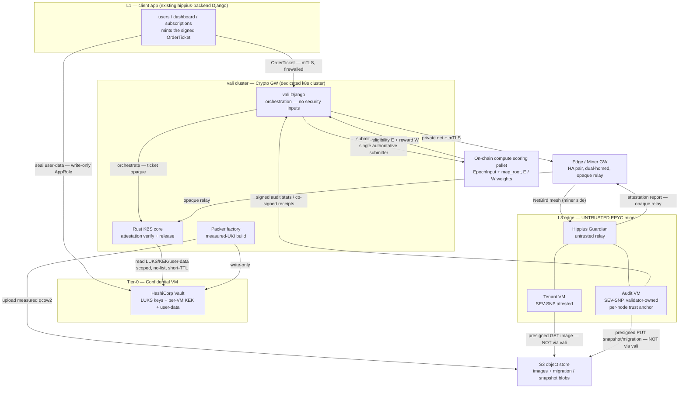
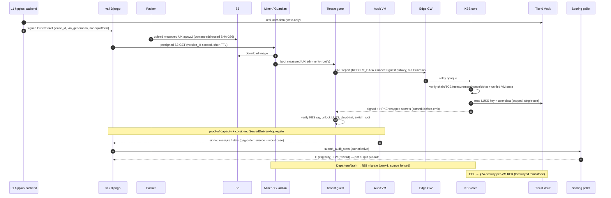
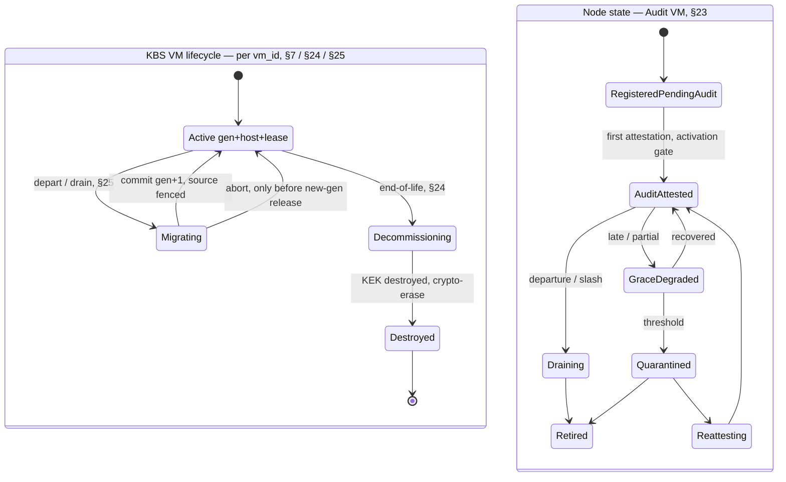

# Hippius Compute — visual overview

Companion to `ARCHITECTURE.md` (the authoritative spec, §§1–26). These
diagrams are a map, not the contract — on any conflict, `ARCHITECTURE.md`
wins. Rendered by GitHub (Mermaid).

---

## 1. Zones & trust boundaries

**Trust:** `L1`, `vali cluster`, `Tier-0 Vault` = trusted. `Edge GW` =
hardened relay (opaque, no plaintext). `L3 miner` = **untrusted**;
trust there comes only from SEV-SNP attestation of the Tenant/Audit VMs,
never from the host or Guardian. Bytes (images, migration blobs) flow
**miner ↔ S3 directly via presigned URLs — never through the validator**.

---

## 2. End-to-end runtime sequence

---

## 3. Unified VM lifecycle + node state

**Key invariants:** the KBS releases a `vm_id`'s key to **at most one
`(gen, host)`** (no *authorized* split-brain); generation is
**forward-only** after any new-gen release; **first attestation is the
activation gate** (no placement / score / reward before it); a
missing/stale/unattested Audit VM ⇒ node treated **worst-case**.
